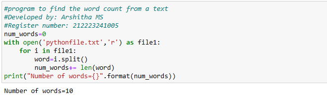
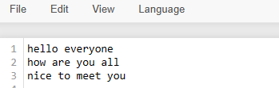

# Word-count
## AIM:
To write a python program for getting the word count from a text.
## EQUIPEMENT'S REQUIRED: 
PC
Anaconda - Python 3.7
## ALGORITHM: 
### Step 1:
Create a file with .txt file extension
### Step 2: 
Add some text in that file
### Step 3: 
Create a python file
### Step 4:  
Write the code to count the number of words in that file
### Step 5: 
Run the program
### Step 6: 
Display the output
## PROGRAM:
```
#program to find the word count from a text
#Developed by: Arshitha MS
#Register number: 212223241005
num_words=0
with open('pythonfile.txt','r') as file1:
    for i in file1:
        word=i.split()
        num_words+= len(word)
print("Number of words={}".format(num_words))
```
### OUTPUT:




## RESULT:
Thus the program is written to find the word count from a text.
